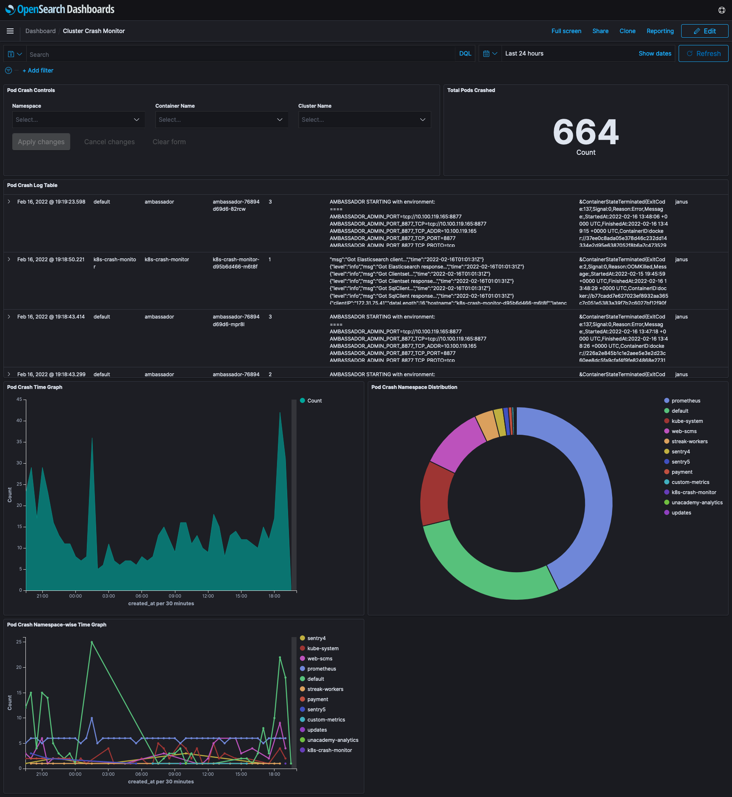

## Kubernetes Pod Monitor

Kubernetes Pod Monitor gives teams visibility into current and historical pod crashes. This provides immediate alerting that reduces the mean time to detect (MTTD). It also captures the error logs and streams them to Elasticsearch. It is integrated with Slack to notify of failures and send messages with details like the last container state, reason for pod failure along with a direct link to the crash logs stored in Elasticsearch.

## Requirements

- Kubernetes version 1.13 or higher
- MySQL version 5.7 or higher
- Elasticsearch version 6.5 or higher
- [Slack access tokens](https://api.slack.com/authentication/token-types) (optional)

## Getting Started

You can deploy Kubernetes Pod Monitor on any Kubernetes 1.13+ cluster in a matter of minutes, if not seconds.
- [Apply MySQL migrations](getting-started/sql.md)
- [Install using the Helm chart](helm-chart/kubernetes-pod-monitor/README.md)

## Usage

- To send slack notifications to a non-default slack channel based on namespace, add a row in the `k8s_pod_crash_notify` table with `clustername`, `namespace` and `slack_channel`.
- To ignore slack notifications for a specific namespace in a cluster, add a row in the `k8s_crash_ignore_notify` table with `clustername`, `namespace` and `containername`.
- Use `k8s_pod_crash` table to create dashboards.
- An indexed document in Elasticsearch consists of following fields:
  - `namespace`: Namespace of the crashed pod
  - `pod_name`: Name of the pod that crashed
  - `container_name`: Container name which restarted. Helpful incase of multiple containers in a pod
  - `created_at`: Timestamp in milliseconds
  - `cluster_name`: Name of the cluster
  - `logs`: Logs of the container before restarting
  - `restart_count`: Number of times the pod restarted
  - `termination_state`: State of the container with reason, message, started at timestamp and finished at timestamp

## Software stack

Golang application. 
Kubernetes.
Elasticsearch.
MySQL.

## Contributors
<table>
  <tr>
    <td align="center"><a href="https://www.linkedin.com/in/shivam-gupta-dtu/"> <b>Shivam Gupta</b></a> </td>
    </tr>
</table>
