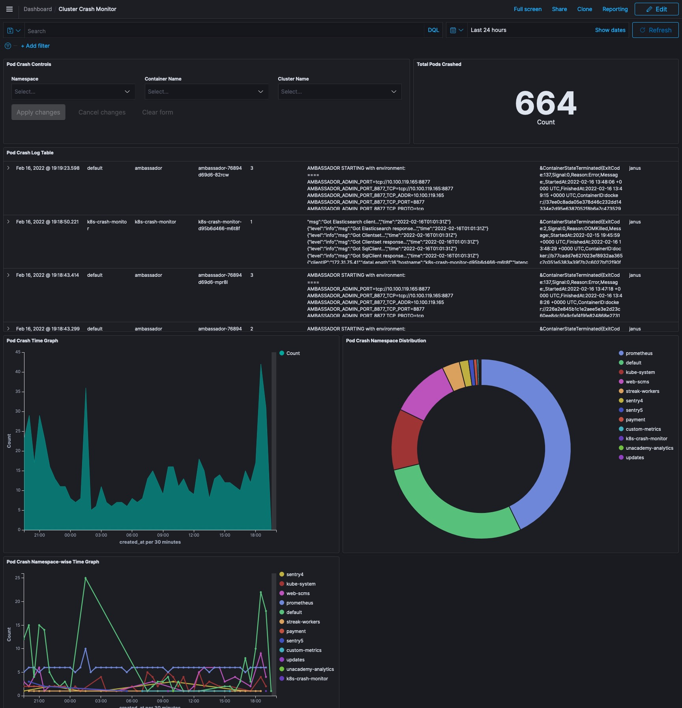

## Kubernetes Pod Monitor

Kubernetes Pod Monitor actively tracks your K8S pods and alerts container restarts alongwith its crash logs thereby decreasing mean time to detect (MTTD). The features include:

- Alerting using slack integration
- Capturing critical crash logs and storing in Elasticsearch
- Historical pod crashes
- Storing container state that gives transparency on pod lifetime and status before termination
- Kibana Visualization for filtering through crashes
- Ability to configure slack channel based on namespace
- Ability to ignore certain namespaces

## Requirements

The following table lists the minimum requirements for running Kubernetes Pod Monitor.

Tool | Minimum version | Minimum configuration
--------- | ----------- | -------
Kubernetes | 1.13 | 100 MB RAM
MySQL | 5.7 | `-`
Elasticsearch | 6.5 | 4 GB RAM

To send alerts via Slack integration, access tokens can be generated here: https://api.slack.com/authentication/token-types

## Getting Started

You can deploy Kubernetes Pod Monitor on any Kubernetes 1.13+ cluster in a matter of minutes, if not seconds.
- Using Helm chart (recommended):
  - [Apply MySQL migrations](getting-started/sql.md)
  - [Install using the Helm chart](helm-chart/kubernetes-pod-monitor/README.md)
  - Import [Kibana dashboard](getting-started/es_saved_objects.json) into Elasticsearch by following https://www.elastic.co/guide/en/kibana/current/managing-saved-objects.html

- Using docker compose:
  - Add kuberentes configuration file to `config` directory and update `CLUSTER_NAME` env variable in docker-compose
  - Run `docker-compose up`

## Usage

- To configure slack notifications, use the [notification management utility](scripts/notification_management_utility.py)
  - Requirements for running the utility:
    - Python v3.6 or higher
    - PyMSQL package to manage MySQL tables: https://pypi.org/project/PyMySQL/
    - Tabulate package to render tables: https://pypi.org/project/tabulate/
  - Run the utility using `python3 scripts/notification_management_utility.py` and follow the steps
- An indexed document in Elasticsearch consists of following fields:
  - `namespace`: Namespace of the crashed pod
  - `pod_name`: Name of the pod that crashed
  - `container_name`: Container name which restarted. Helpful incase of multiple containers in a pod
  - `created_at`: Timestamp in milliseconds
  - `cluster_name`: Name of the cluster
  - `logs`: Logs of the container before restarting
  - `restart_count`: Number of times the pod restarted
  - `termination_state`: State of the container with reason, message, started at timestamp and finished at timestamp

## Software stack

Golang application. 
Kubernetes.
Elasticsearch.
MySQL.

## Contributors
<table>
  <tr>
    <td align="center"><a href="https://www.linkedin.com/in/shivam-gupta-dtu/"> <b>Shivam Gupta</b></a> </td>
    </tr>
</table>
